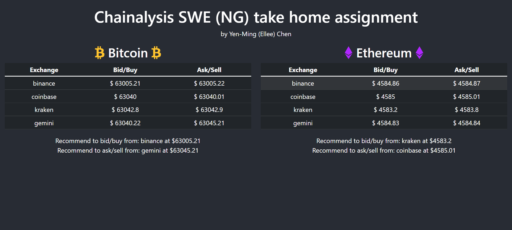

## Chainalysis

- Chainalysis SWE (New Grad) take home assignment.

- Built by using **_React_** and **_Node.js_**.

# View Here -> TBU

### Website Pages Preview:

### How to Build & Run

#### Backend

1. `cd chainalysis_oa-api`
2. `npm install`
3. Remenber to include a `.env` file with the CoinAPI key
4. `npm server.js` or `nodemon server.js` if have install nodemon

ps. Can comment out `getPrices()` function inside `server.js` and use static data if don't have CoinAPI key

#### Frontend

1. `cd chainalysis_oa`
2. `npm install`
3. `npm start`

### Questionnaire

#### 1. Are there any sub-optimal choices( or short cuts taken due to limited time ) in your implementation?

Since it was during midterm, I almost forgot this assignment as my emails piled up. That said, I'd only got two days to finish it although Chainalysis was nice enough to provide 10 days originally. I wasn't familiar with cryptocurrency and didn't have time to figure out all the terminology, so I googled "best free cryptocurrency api". After some research and testing, I chose CoinAPI because it fits the requirements. However, this API has daily request limit for free user account, which caused me not being able to separate api call based on cryptocurrency. That's one of the reason I chose not to refresh the data automatically, or created a button for user to refresh.

The other short cuts I took was not using Spring Boot for the backend since Node.js is fast to implement. If time premits, I'd like to use the same backend technology as Chainalysis does.

#### 2. Is any part of it over-designed? ( It is fine to over-design to showcase your skills as long as you are clear about it)

One of the features of React is to use components. When I first picturing the UI, I separated them into smaller components, which might not be necessary for this simple display.

Data flows from one component to another. If this was all in a singal component, I would've not needed to do this. Another problem of doing this is that I needed to consider asynchronous state/props updates.

#### 3. If you have to scale your solution to 100 users/second traffic what changes would you make, if any?

Grab my wallet and pay. 💸

#### 4. What are some other enhancements you would have made, if you had more time to do this implementation

- The refresh mechanism
- Link to exchange websites for real transaction
- Implementation of user account
- Setup database to keep records of each user's transaction choices
