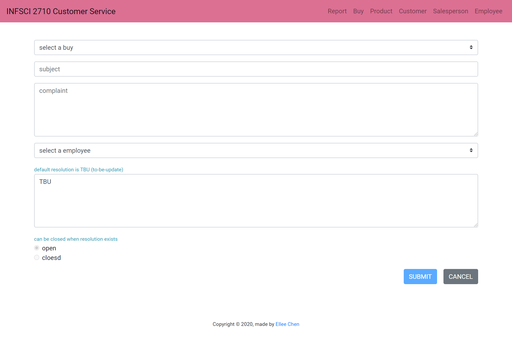
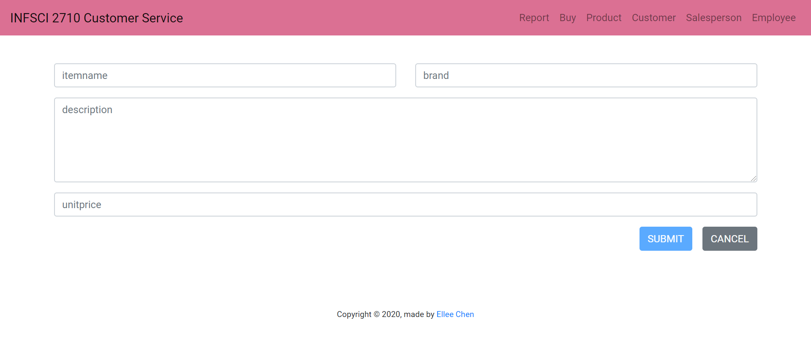
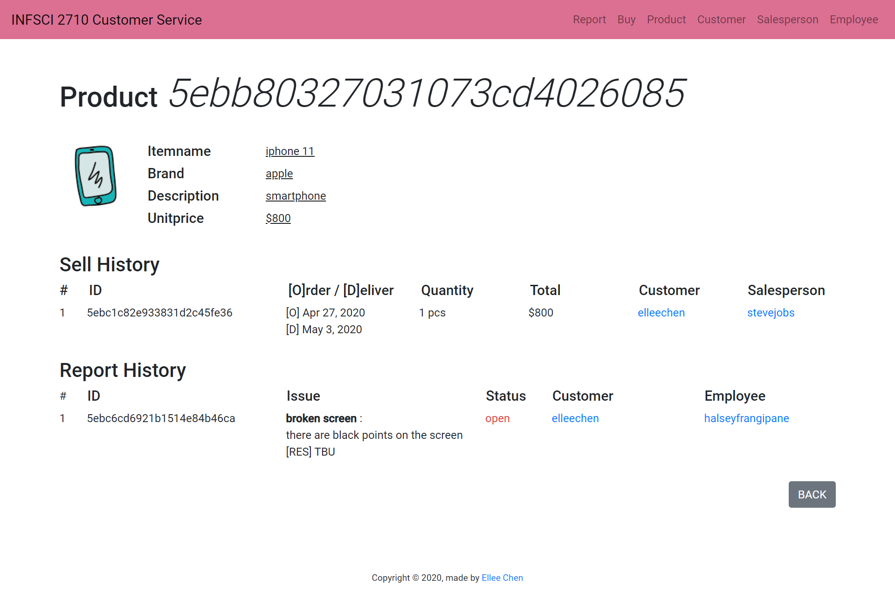
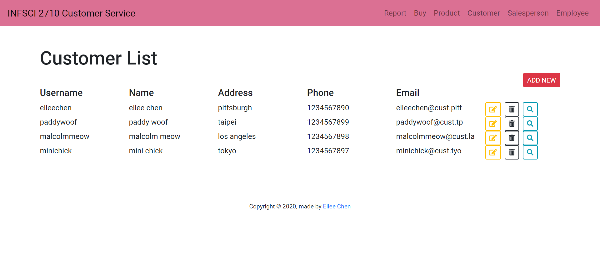
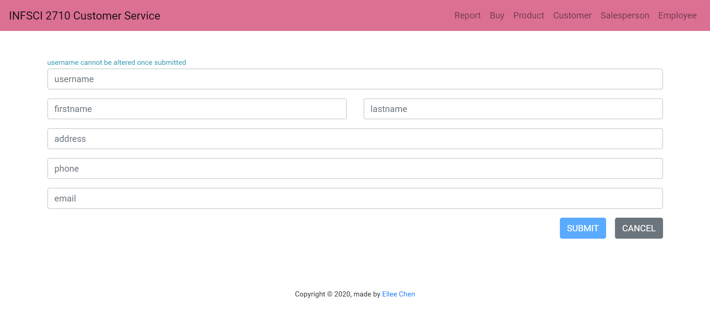
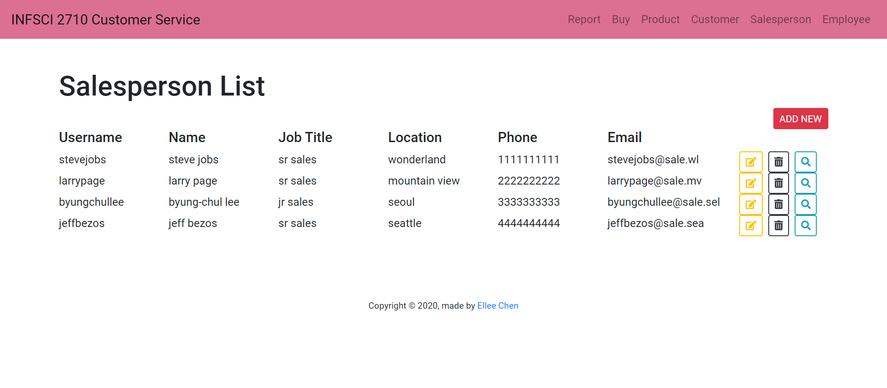
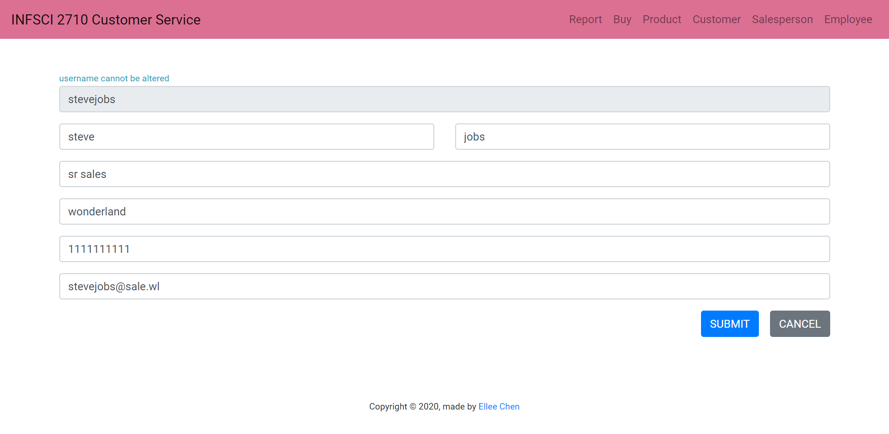
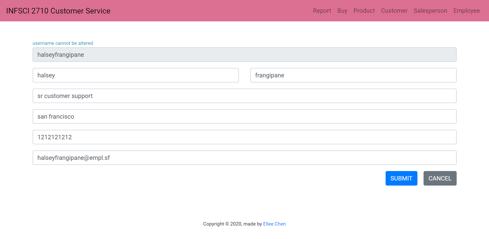

## customer_service

A recreation of INFSCI 2710 final project using MEAN stack and Bootstrap

# [https://elleech.github.io/infsci2710-customer_service/reports](https://elleech.github.io/infsci2710-customer_service/reports)

### Design Documentation:

[https://github.com/elleech/web_practice/blob/master/customer_service/doc-customer_service.pptx](https://github.com/elleech/web_practice/blob/master/customer_service/doc-customer_service.pptx)

### ER Model

### Web Pages Screenshot

- **Report List**

  

- **Add New Report**

  

- **Edit One Report**

  

- **Buy List**

  

- **Add New Buy**

  

- **Edit One Buy**

  

- **Product List**

  

- **Add New Product**

  

- **Edit One Product**

  

- **Lookup One Product**

  

- **Customer List**

  

- **Add New Customer**

  

- **Edit One Customer**

  

- **Lookup One Customer**

  

- **Salesperson List**

  

- **Add New Salesperson**

  

- **Edit One Salesperson**

  

- **Lookup One Salesperson**

  

- **Employee List**

  

- **Add New Employee**

  

- **Edit One Employee**

  

- **Lookup One Employee**

  
  
