## image_repository

- An image shopping website which allows users to upload image or buy other people's images. Although it's called "image repository", it does not provide space for users to store images. They'll need to store it somewhere else and provide the URL.

- This project referenced a challenge of 2021 Shopify Developer Intern that I found online. They have a few requirements/ideas of the repository. The detailed description is in [Fall 2021 - Shopify Developer Intern Challenge.docx](https://github.com/elleech/web_practice/blob/master/image_repository/Fall%202021%20-%20Shopify%20Developer%20Intern%20Challenge.docx).

- Built by using **_MERN stack_** and **_Bootstrap_**.

_P.S. I don't own any photos inside the demo. They are resources from the Internet._

<!-- # View Here ->  -->

### Notes & Documentation: [doc-image_repository.pptx](https://github.com/elleech/web_practice/blob/master/image_repository/doc-image_repository.pptx)

### ER Model:

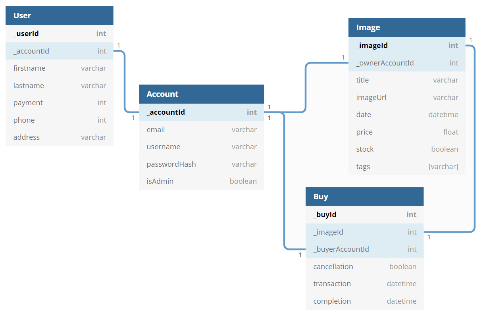

### Backend Permission Hierarchy:

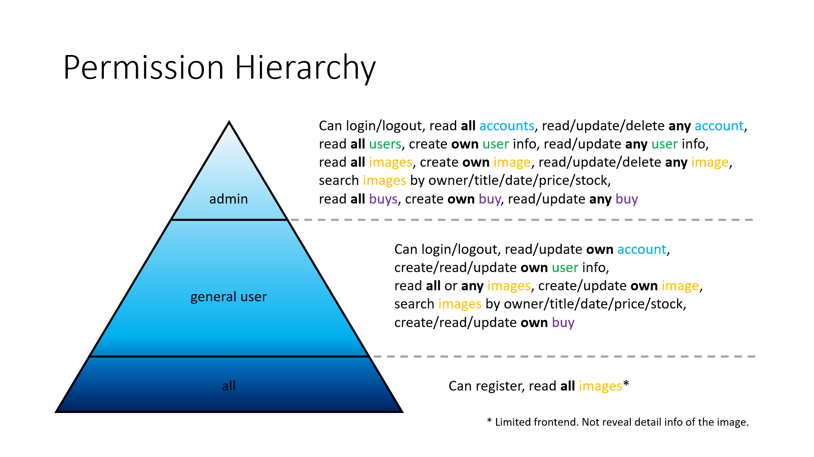

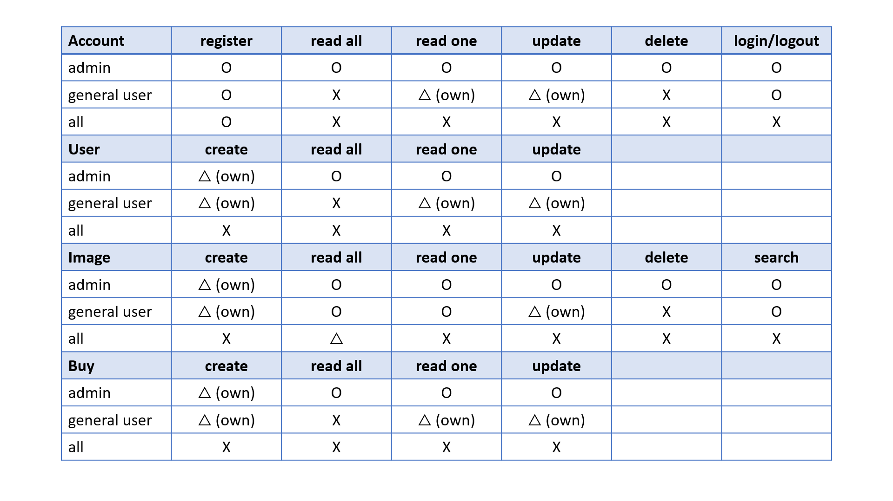

### Website Pages Preview:

- Home (before login)

  

  - Register/Login

    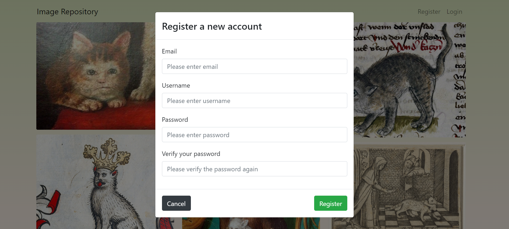

    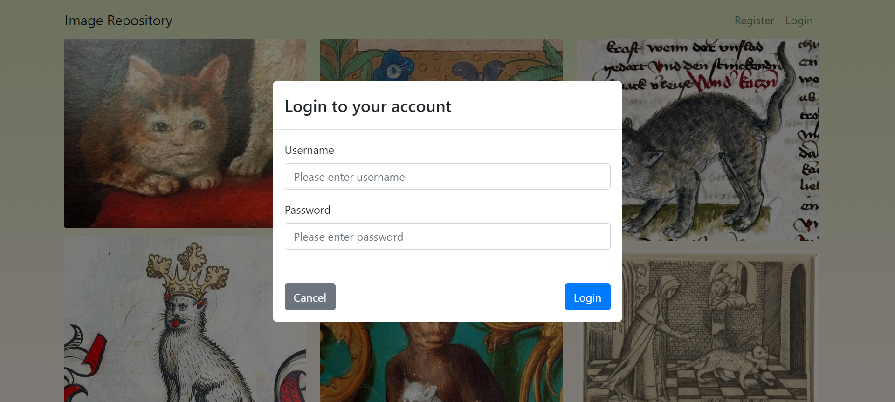

- Home (after login)

  

  - Buy from Home

    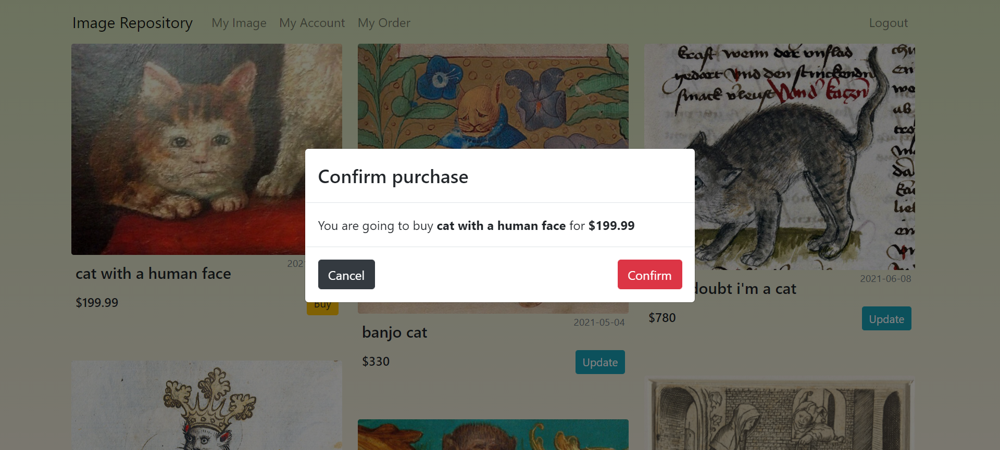

- My Image

  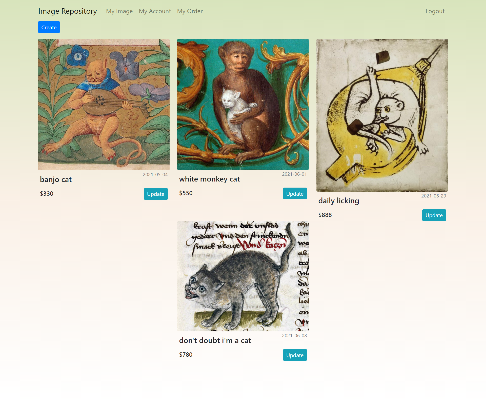

  - Create/Update from My Image

    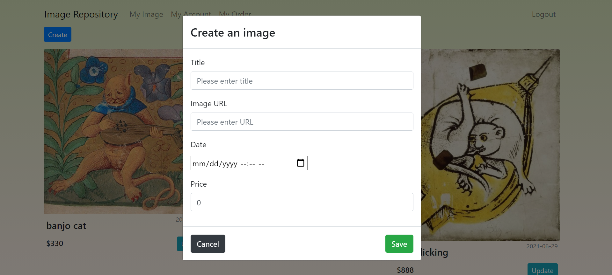

    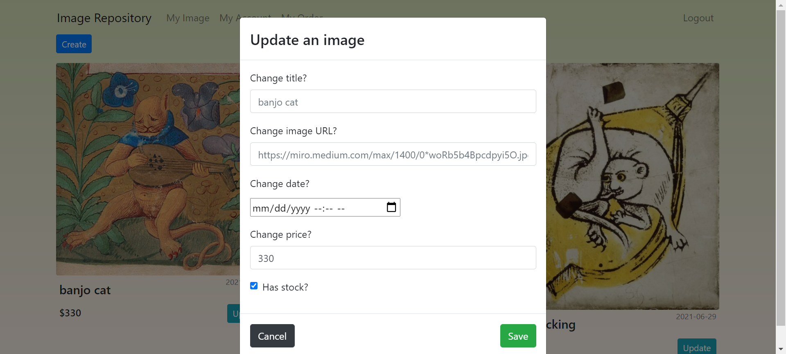

  - Update a sold image shipment from My Image

    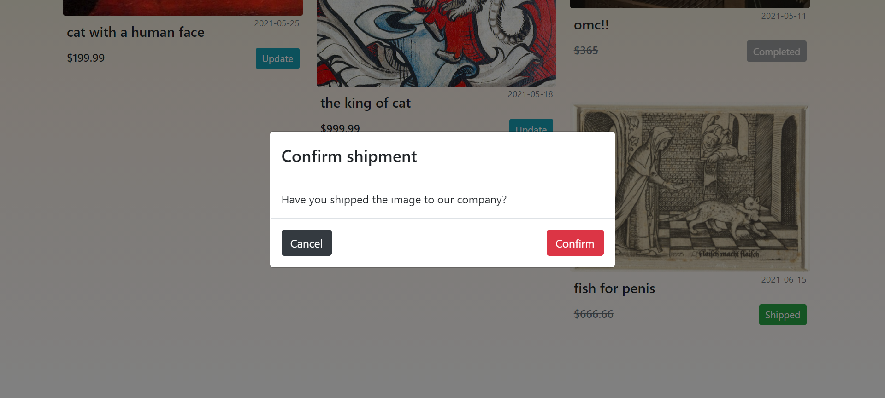

- My Account

  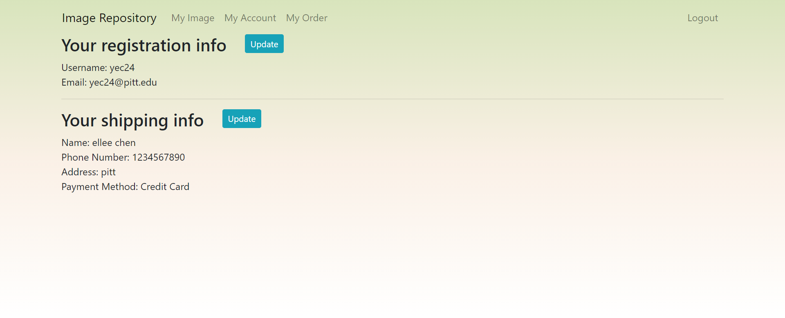

  - Update Account/Shipping Info

    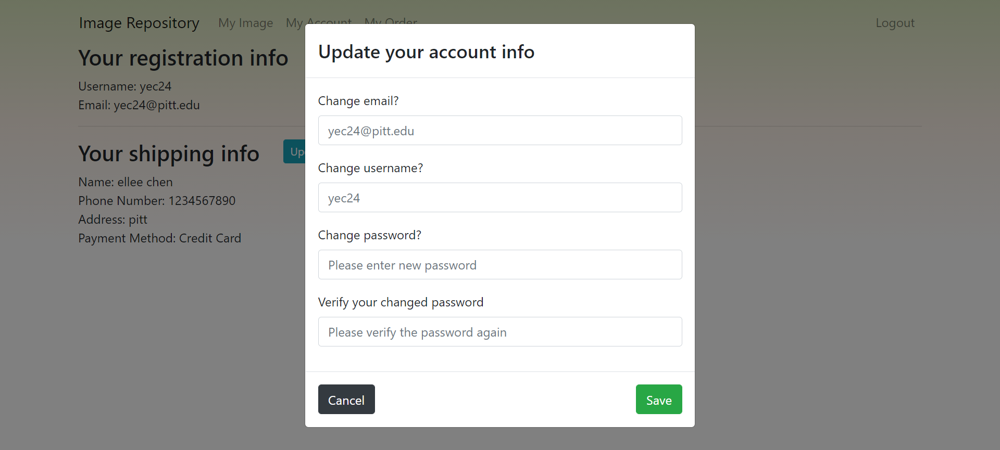

    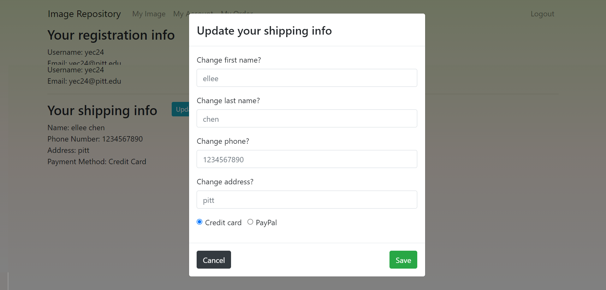

  - Create Shipping Info

    (Account doesn't have shipping info when register. Everyone needs to set it up to unlock purchase button.)

    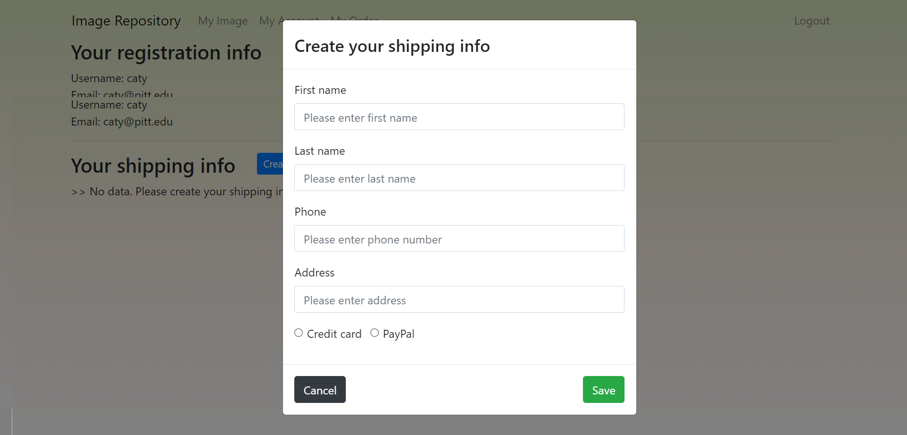

- My Order

  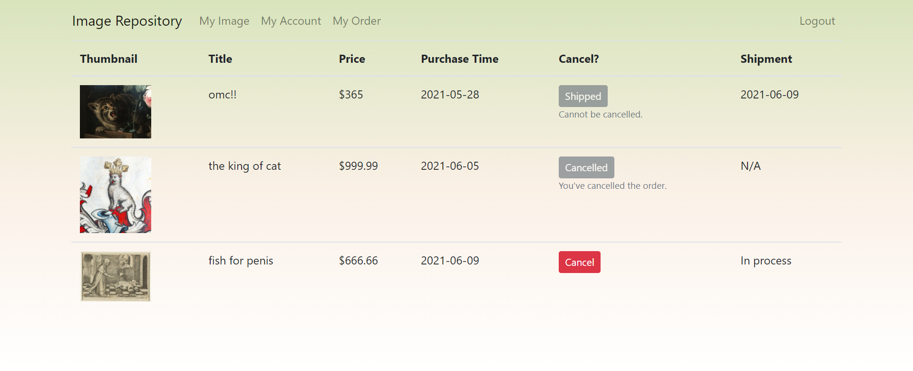

  - Cancel an order

    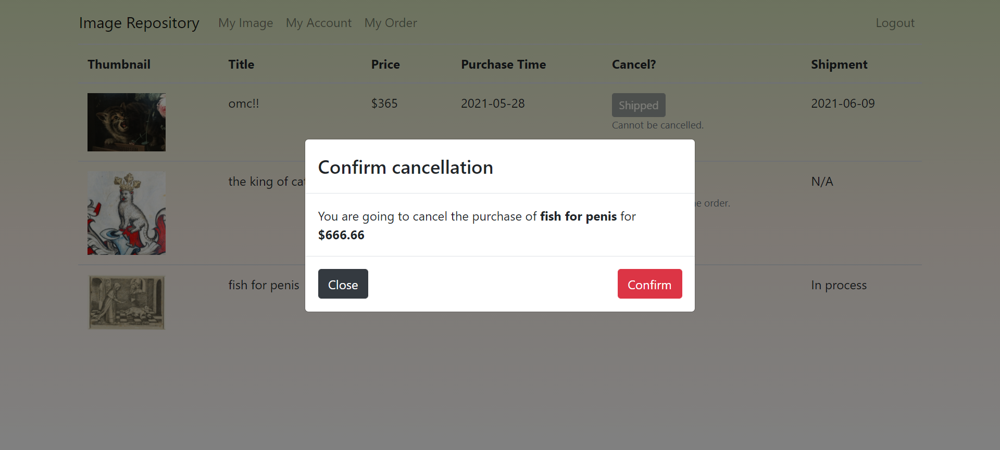
